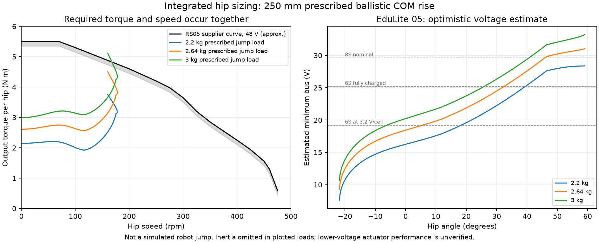

# Integrated hip actuator comparison

**Continue a four-motor integrated-hip study, using RS05 as the first CAD and
reference-curve candidate. Neither actuator is adopted.** The custom X2216/16:1
drive remains the fallback and remains in the viewer. This directory contains
sizing and mounting evidence, not a released robot or a simulated jump.

Open the local comparison at `http://localhost:8765/viewer/v2-actuator.html`.
The viewer displays the archived RS05 supplier CAD and current gear layout at
the same scale. Its optional spindle probe shows the existing shaft conflict.
The full-robot page retains the custom drive. `../export_actuator_viewer.py`
exports all 31 supplier solids and binds their identity to the mounting report;
illustrative finishes are not material or inertia assignments.

## Source findings

The [RS05 manual](../hardware-references/integrated-hips/RS05User-Manual260713.pdf)
and [supplier STEP](../hardware-references/integrated-hips/RS05.STEP) are archived
from RobStride's official repository. Printed manual pages 8-11 were rendered
and inspected. The imported STEP contains 31 valid source solids.

| Per hip | Custom drive | EduLite 05 | RS05 |
|---|---:|---:|---:|
| Listed subtotal | $70.75 motor + four gears | $80 integrated | $110 integrated |
| Reduction | 16:1, two external stages | 9:1 internal | 7.75:1 internal |
| Driver / feedback | Additional, unfinished | Included / two encoders | Included / two encoders |
| Published module mass | Subsystem incomplete | 242 g | 191 g |
| Published peak torque | Transmission unqualified | 6 N m | 5.5 N m |
| Supply | Existing screen: 3S | 15-60 V, rated 48 V | 15-60 V, rated 48 V |

Prices exclude tax, shipping and remaining hardware. Differences of $9.25/$39.25
against the unfinished custom subtotal are not total-system savings.

The detailed July RS05 manual and website say **1.6 N m at 100 rpm with a
70 x 70 mm aluminum heat sink**; the July repository table says 1.8 N m.
Use the lower detailed rating until resolved. Continuous **stall is 1.2 N m**.
The manual permits 5.5 N m for 1 s stalled or 3 s rotating under its stated
thermal conditions. These do not qualify enclosed operation or repeated jumps.
Neither small actuator has an established IP or impact rating in these sources.

The 44 mm length describes the RS05 body. Actual supplier CAD is
**46 x 46 x 47 mm including three locating pins**. Its central material obstructs
the existing 8 mm fixed hip spindle: source solids 0, 16 and 17 intersect that probe.

## Torque and speed must occur together

`../integrated_hip_screen.py` uses current V2 leg dimensions and aligned springs
on both sides. It prescribes constant vertical acceleration over 153.1 mm to
give **250 mm ballistic COM rise** after takeoff. Launch lasts about 138 ms;
peak hip speed is 178 rpm. This is not 250 mm wheel clearance, a free-robot
simulation or a landing check.

| Mass allowance | Peak per-hip torque, guide friction 0.4 | Margin against RS05 **48 V** graph* |
|---|---:|---:|
| 2.20 kg | 3.75 N m | +0.98 N m |
| 2.64 kg | 4.50 N m | +0.23 N m |
| 3.00 kg | 5.12 N m | -0.39 N m |

*Approximate readings of the supplier graph, minus a chosen 0.15 N m reading
allowance. This is not a supplier tolerance. Table loads omit extra rotational
inertia. All nine friction/inertia sensitivity cases fit at 2.2 and 2.64 kg;
three of nine fit at 3 kg. Assumed output inertias 0/0.0005/0.002 kg m2 are not
identified hardware values. Failing this prescribed profile does not prove that
a different launch cannot work. Independent energy and resolution checks pass.

RS05 line resistance and lower-voltage loaded performance are **unknown** in the
inspected source. The calculation does not rescale its 48 V graph into a pass.

EduLite's official site gives line resistance 2.72 ohm, back-EMF 7.4 Vrms/krpm
and output torque constant 0.94 N m/Arms. An optimistic sinusoidal model estimates
peak minimum bus voltage **28.4/31.0/33.2 V** at 2.2/2.64/3.0 kg. The selected
favorable/adverse constant variations give 24.5-32.8 V at 2.2 kg. Back-EMF
conventions are inferred from consistency with RS05's Kt, not manufacturer
confirmation. Inductance, saturation, extra inertia and driver losses are
omitted. A voltage estimate below a proposed bus is not a performance pass.
3S is outside both products' stated range; a 6S jump-capable replacement is not
established.

At 2.2 kg, static ride load is estimated at 0.13 N m per hip with two loaded legs,
or 1.35 N m with one loaded leg. Fully extended values are 1.43/2.85 N m.
This motivates distinct thermal limits for ride, extension and brief single-wheel
skills. It does not establish lateral equilibrium or dynamic balance.

## Removing the fixed spindle

`../integrated_hip_cad.py` also checks the existing tie section moved to the
body side of the thigh. The proposed actuator output face sits at Y=58 mm;
a 16 mm radius flange ends at Y=61.2, followed by an 11.5 mm radius rotating
neck to the thigh at Y=71. A stationary anchor could occupy Y=61.5-64.5, with
the tie root eye at Y=64.8-69.8.

In 405 samples over hip angles -2.8 to 1.08 rad, the 3 mm half-width tie and
5/4 mm radius eyes clear that neck envelope by at least **1.035 mm**. The tie is
1.2 mm inboard of the existing thigh plane. This suggests a body-mounted anchor
can replace the through-spindle, without an offset transmission or extra motor.

The anchor, fasteners and moved knee lever are not designed. The knee lever
must be swept against the spring and wheel assembly. Mounting, heat sink,
actuator bearing moment capacity, independent-leg clearance and strength remain
open. This is a local envelope calculation, not a complete mechanical-fit pass.

## Power-system leads, not selections

Two [CNHL 45706G 450 mAh 6S packs](https://chinahobbyline.com/products/cnhl-ministar-series-450mah-22-2v-6s-70c-lipo-battery-with-xt30-plug)
cost $35.98 per pair, weigh 170 g nominal and measure 19 x 41 x 67 mm each,
with a stated 1-5 mm dimensional difference. In series they would provide
44.4 V nominal / 50.4 V full at 450 mAh. A full-discharge loaded-curve result,
tolerance-aware fit, harness, cell monitoring, charging and regeneration design
are absent. These packs have not been adopted.

A [Flipsky Dual FSESC4.20 Plus](https://flipsky.net/products/dual-fsesc4-20-plus-based-on-vesc-with-anodized-aluminum-heatsink)
supports 8-60 V and regeneration, listed at $116 and 64 x 84 x 20.5 mm including
heat sink. It does not fit the current 32 x 92 x 24 mm controller bay in an
axis-aligned orientation. Sensor compatibility, low-current control, net mass
and suitability for the small wheel motors remain unverified. Store shipping
weight must not be used as robot mass.

RS05 hips + that dual driver + those packs already total **$371.98**, before
wheel motors/gears, wheel encoders, mounts and other electronics. EduLite gives
$311.98 for the same incomplete bundle. This prevents treating an $80 actuator
as proof of a cheaper robot. Official product JSON and retrieval hashes are
archived in `hardware-references/integrated-hips/`; nothing was purchased.

Next: develop the inboard anchor and knee arrangement into a mounted assembly,
compare actual power-component envelopes and complete masses, and build a native
V2 dynamic plant to compare both drive routes on the required skills. The 48 V
RS05 curve is a reference case, not full battery-range validation. Keep four
motors unless motion evidence calls for more mechanical degrees of freedom.
